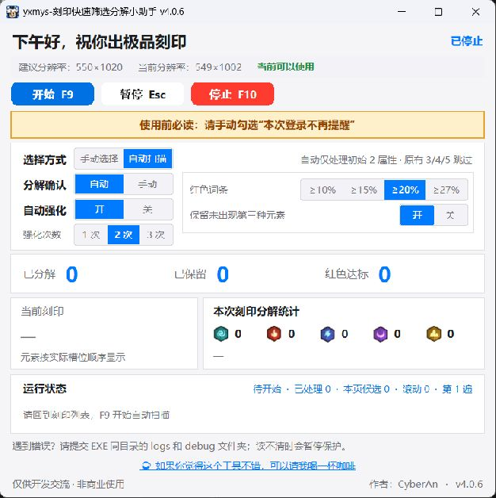

# 刻印快速筛选分解小助手

  

用于《英雄没有闪》微信小程序的 Windows 刻印辅助工具。支持自动扫描刻印列表、按设定次数强化，根据红色词条与元素类型判断保留或分解，也可以手动选择刻印。

[下载最新正式版](https://github.com/CyberAn-Dev/yxmys-imprint-assistant/releases/latest) · 作者：CyberAn

## 界面预览

  

## 怎么使用

1. 下载正式版 EXE，直接打开，无需安装 Python。
2. 在电脑上打开游戏，进入**刻印列表**。按游戏提示手动勾选 **“本次登录不再提醒”**。
3. 建议游戏窗口使用 **550×1020**。查看助手内的分辨率与可用状态，确认可以使用；运行期间保持游戏窗口可见，不要移动、缩放或遮挡，也不要同时手动操作游戏。
4. 选择处理方式和筛选条件。默认是 **自动扫描、强化 2 次、红色词条 ≥20%**，并开启“保留未出现第三种元素”。分解确认可选自动或手动。
5. 点击 **开始 / F9**。助手会逐枚处理、向下扫描，完成后显示本轮处理数、保留数及库存变化。需要暂停按 **Esc**，停止按 **F10**。

想自己选择刻印时，切换为“手动选择”，打开目标刻印详情后再开始。

### 筛选与保护

- 自动扫描仅处理本轮初始 **2 个属性**的刻印，原有 **3 / 4 / 5 个属性**跳过；本轮从 2 个强化到 5 个的刻印仍按筛选条件判断。
- 红色词条达到所选阈值则保留；**没有红字**且开启元素保留开关时，满足不超过两种元素的规则也会保留。已有红字但低于阈值，不按元素规则保留。
- 读不清、材料不足或出现异常时可能保护暂停。请人工检查，回到列表后重新开始；中断后已有 3 / 4 / 5 属性的刻印需自行检查。
- 完成仅代表当前筛选列表本次扫描结束。使用前请确认筛选设置，自动分解存在不可恢复风险。

遇到问题，请提交 EXE 同目录的 `logs` 和 `debug` 文件夹协助排查；分享前检查其中是否含有不想公开的截图或信息。

仅供学习交流，非游戏官方工具，请自行了解并遵守游戏规则。

## 支持作者

如果你觉得这个工具不错，可以请我喝一杯咖啡 ☕

  

